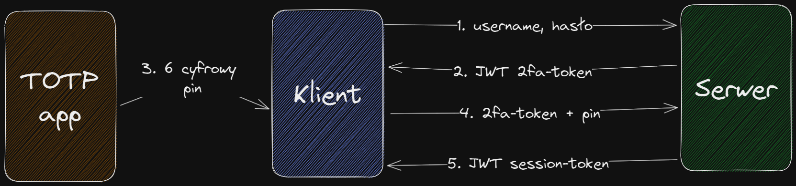

# 2fa React .NET
Repozytorium, które zawiera (imho) najprostszą możliwą implementację 2FA z użyciem kodów czasowych (totp) i kodów jednorazowych (jako fallback option w przypadku utraty generowania kodów czasowych).

# Spis treści
- [Dlaczego](#dlaczego)
- [Technologie wiodące](#technologie-wiodące)
- [Użyte biblioteki](#użyte-biblioteki)
- [Start projektu](#start-projektu)
- [Podstawowy scenariusz użycia](#podstawowy-scenariusz-użycia)
- [Workflow użytkownika video](#workflow-użytkownika-video)
- [Diagram rejestracji](#diagram-rejestracji)
- [Diagram logowania](#diagram-logowania)
- [Techniczny use case](#techniczny-use-case)
- [Produkcyjne TODO](#produkcyjne-todo)
- [Aplikacje TOTP](#aplikacje-totp)

# Dlaczego
Projekt powstał jako nauka uwierzytelniania 2-składnikowego (2FA), co obecnie staje się standardem dla aplikacji/serwisów, którym zależy na bezpieczeństwie dostępu do zasobów/danych. Projekt powstał z narzuconymi sobie wytycznymi:
 - Implementacja 2FA tak łatwo jak to tylko możliwe.
 - Optymalny wygląd (minimum kompnentów, ale niech nie kłują w oczy).
 - Optymalne bezpieczeństwo (minimum kodu, ale możliwie maksimum bezpieczeństwa).
 - Fokus na idei zrozumienia i implementacji.

Ostatnie dotyczy 

# Technologie wiodące
 - [React](https://pl.reactjs.org)
 - [.NET 6.0](https://dotnet.microsoft.com/en-us/download/dotnet/6.0)

# Użyte biblioteki
## Frontend
 - `bootstrap`, `@popperjs/core` - stylowanie i komponenty front-end.
 - `jwt-decode` - dekodowanie JWT, żeby wydobyć nazwę użytkownika.
 - `qrcode.react` - zamiana ciągu znaków na kod QR.
 - `react`, `react-dom`  - podstawa front-endu.
 - `react-router-dom` - ścieżki (`login/`, `register/`) z widokami w aplikacji.
 - `react-toastify` - wyskakujące powiadomienia w rogu aplikacji.
 - `zustand` - state management (prostsze od reduxa).

## Backend
 - `Microsoft.AspNetCore.Authentication.JwtBearer` - implementacja JWT jako sposobu autentykacji.
 - `Otp.NET` - generowanie i walidacja kluczów czasowych (TOTP).
 - `Swashbuckle.AspNetCore` - dokumentacja API Swaggera.
 - `System.IdentityModel.Tokens.Jwt` - tworzenie, serializacja i walidacja JWT.

# Start projektu
1. Sklonuj repo do siebie.
2. Przejdź do folderu `front/` i wykonaj:
    ```sh
    npm install
    ```
3. Po zainstalowaniu zależności wystarczy wykonać:
    ```sh
    npm run dev
    ```
    W konsoli powinno pokazać, że vite zbudował aplikację i można ją odwiedzić pod adresem np.:
    ```sh
     Local:   http://127.0.0.1:3000/
    ```
4. W drugim oknie konsoli przejdź do folderu `server/` i wykonak:
    ```sh
    dotnet restore
    ```
    lub za pomocą Visual Studio (wystarczy zbudować projekt).

5. Uruchomić lokalny serwer za pomocą komendy:
    ```sh
    dotnet run
    ```
    lub za pomocą Visual Studio (Uruchomić projekt za pomocą `LocalDebug`).
6. Adres serwera w pliku `front/src/appConfig.ts` powinien pokrywać się z tym w pliku `server/Properties/launchSettings.json` w sekcji `profiles.LocalDebug.applicationUrl` z początkiem `http://`.
7. Jeśli wszystko przeszło bez błędów - otworzyć przeglądarkę i wejść do aplikacji (`http://localhost:3000`)

# Podstawowy scenariusz użycia
1. Użytkownik otwiera aplikację front-end: `localhost:3000`.
2. W navbarze po lewej widzi, że jest anonimowym użytkownikiem
3. Po wejściu w zakładkę `Pogoda` dostaje informację, że nie ma dostępu, bo jest niezalogowany.
4. Przechodzi do zakładki `Zarejestruj`.
5. Wpisuje nazwę użytkownika i hasło.
6. Jeśli użytkownik z nazwą jest w bazie, to dostaje odpowiedni komunikat.
7. Jeśli użytkownik jest nowy - formularz rejestracyjny znika i pojawia się lista rozwijana z 2 elementami: `Kod QR` i `Kody jednorazowe`.
8. Rozwija sekcję `Kod QR` i skanuje kod QR aplikacją do kluczy TOTP (*Google Authenticator*, *Authenticator* od Microsoft, *Authy* od Twilio, *Secure SignIn* od Synology).
9. Aplikacja konsumuje QR poprawnie i wyświetla ciąg 6 cyfr co 30 sekund.
10. Użytkownik rozwija sekcję `Kody jednorazowe`, zapoznaje się z informacją i kopiuje kody jednorazowe.
11. Użytkownik przechodzi do zakładki `Zaloguj`.
12. Wpisuje nazwę użytkownika i hasło podane podczas rejestracji.
13. Formularz wyświetla klucz do wpisania.
14. Uzytkownik wpisuje 6-cyfrowy kod z aplikacji, lub podaje jeden z kodów jednorazowych.
15. Użytkownik jest pomyślnie zalogowany.
16. Przechodzi do zakładki `Pogoda` i klika `Pobierz pogodę`.
17. Apliakcja wyświetla karty z informacjami pobranymi z serwera, które są zarezerwowane dla zalogowanych użytkowników.s
18. Użytkownik klika `Wyloguj`.
20. Strona odświeża się, użytkownik jest wylogowany.

# Workflow użytkownika video
[](https://user-images.githubusercontent.com/60105537/229519238-139a4992-f08a-40cf-b8ae-c18b533d8d01.mp4)

# Diagram rejestracji

1. `username, hasło` - serwer dostaje `username` i `hasło`.
2. `generate(kody), generate(totp-secret)` - serwer generuje jednorazowe kody i klucz do totp.
3. `username, hash(hasło), hash(kody), totp-secret` - serwer zapisuje użytkownika (z zahashowanym hasłem i jednorazowymi kodami) do bazy.
4. `totp-uri + jednorazowe kody` - serwer zwraca użytkownikowi niezahashowane kody jednorazowe i totp-uri (który zawiera klucz totp).
5. `Skanowanie QR Code z totpUri` - użytkownik skanuje kod QR (który zawiera totp-uri). Klucz totp zapisuje się na urządzeniu mobilnym i generuje kody co 30 sekund.

# Diagram logowania

1. `username, hasło` - serwer dostaje `username` i `hasło`. Sprawdza, czy hasło zgadza się z tym zaszyfrowanym w bazie.
2. `JWT 2fa-token` - serwer generuje token JWT, który służy tylko do 2 składnika uwierzytelniania i ma ważność np. 3 minuty.
3. `6 cyfrowy pin` - użytkownik podaje 6-cyfrowy pin z aplikacji mobilnej.
4. `2fa-token + pin` - serwer sprawdza, czy JWT token jest prawidłowy. Sprawdza pin pod kątem totp, a jeśli to nie zadziała - sprawdza czy jest to kod jednorazowy.
5. `JWT session-token` - jeśli token i pin się zgadzają - serwer zwraca JWT (z okresem ważności np. 2 dni) do pozostałych obszarów systemu.

# Techniczny use case
1. Klient wysyła żądanie GET o pogodę: `/WeatherForecast` - serwer zwraca 401.
2. Klient wysyła żądanie POST rejestrację: `/user/register`.
3. Serwer sprawdza, czy taki użytkownik jest w bazie.
4. Jeśli nie to wykonuje:
    1. Hashuje hasło użytkownika
    2. Tworzy jednorazowe kody na podstawie generowanego GUID
    3. Hashuje kody jednorazowe
    4. Zapisuje użytkownika do bazy (z hashowanym hasłem i kodami)
    5. Zwraca niezahashowane kody i specjalny **TOTP uri** do klienta.
5. Klient wyświetla kody jednorazowe i generuje kod QR z pobranego **TOTP uri**.
6. Klient wysyła żądanie POST `/user/login` z parametrami:
    ```ts
    {
        username: string,
        password: string
    }
    ```
7. Jeśli hasło jest poprawne - serwer zwraca JWT z krótkim okresem ważności (3 min.). Tylko tym typem tokenu można dostać się do 2 składnika logowania.
8. Klient wysyła żądanie POST (ze specjalnym krótkookresowym tokenem) `user/2fa` z parametrami:
    ```ts
    {
        pinCode: string
    }
    ```
    Gdzie `pinCode` to wygenerowany totp lub kod jednorazowy.
9. Serwer weryfikuje `pinCode`:
    1. Czy jest zgodny z totp.
    2. Jeśli nie, sprawdza czy występuje on w kodach jednorazowych użytkownika.
    3. Jeśli tak, usuwa kod przypisany do użytkownikowa.
10. Jeśli totp lub kod jednorazowy są poprawne - zwraca jwt z dłuższym okresem ważności (2 dni), który pozwala autoryzować się do docelowych endpointów.

# Produkcyjne TODO
Sam projekt nie jest kompletnym rozwiązaniem produkcyjnym, a bardziej nauką/pomocą/narzędziem podczas implementacji własnych rozwiązań. Jeśli chcesz użyć tego projektu jako podstawy do stworzenia pełnoprawnej aplikacji, użyj poniższej listy TODO, żeby zaimplementować niezbędne składniki.
 - [ ] **Utworzenie warstwy serwisowej**

    Na ten moment logika działania aplikacji jest w Controllerach, żeby zminimalizować kod. W aplikacji produkcyjnej należy oddzielić logikę biznesową aplikacji od controllerów.

 - [ ] **Logi aplikacji**

    Należy logować podejrzane zachowania ze strony klienta (niepoprawny/przestarzały kod czasowy, nieporprawny kod jednorazowy, domyślne hasło dla użytkownika niepoprawne, JWT przestarzały itp.). Oraz pozostałe obszary systemu. Należy pamiętać o wielu wartwach logów (DEBUG, INFO, WARNING, ERROR, FATAL), używać odpowiednich narzędzi do składowania logów (txt, sql) i ich przekazywania (np. [log4net](https://www.nuget.org/packages/log4net/))

 - [ ] **Alternatywne 2FA**
    
    Aplikacja korzysta z 2 form 2FA - TOTP (kody czasowe) i kody "spalane" (jednorazowe). W produkcyjnej aplikacji warto zatroszczyć się o np:
    - **Email OTP** - jednorazowe hasło wysyłane na skrzynkę mailową z krótkim okresem ważności.
    - **Key OTP** - hasła generowane jednorazowo przez fizyczne klucze szyfrujące podpięte do urządzenia (te same kody prywatne w kluczu fizycznym i na serwerze i weryfikacja po stronie serwera, czy kod wygenerowany przez klucz fizyczny jest poprawny).
    - **OAuth 2.0 + 2FA** - logowanie za pomocą zewnętrznego dostawcy, któremu ufamy (Google, Facebook, Microsoft, Twitter, Discord). Dzięki temu użytkowik nie musi wpisywać kodów przy każdym logowaniu, ale skorzystać z np. odcisku palca. **Dostawcy pozwalają wymuszać 2FA** jeśli użytkownik chce się zalogować do naszej aplikacji - warto przycisnąć użytkownika, że nie ma wyjścia i musi użyć 2FA (hasło + odcisk palca/potwierdzenie) u zewnętrznego dostawcy.

 - [ ] **Powiadomienia frontendowe**

    Końcowy użytkownik aplikacji powinien mieć na tyle dokładne powiadomienia, żeby wiedział co zrobił źle, jakich informacji brakuje i jak to poprawić. Nie może natomiast dostawać powiadomień o błędach systemu ze względów bezpieczeństwa. Komunikaty powinny być krótkie, przejrzyste i dostosowane do tego, żeby pomóc użytkownikowi nawigować po aplikacji

 - [ ] **Globalny error handler**
    
    Obecnie backend zwraca Exceptions, które są trymowane po stronie klienta. W produkcyjnej aplikacji **nie można wysyłać błędów systemu** do użytkownika, ale posiadać globalny exception handler, który "skonsumuje" błędy i sparsuje odpowiedź zakrywając logikę systemu serwerowego. Należy do tego użyć odpowiednich [kodów odpowiedzi HTTP](https://developer.mozilla.org/en-US/docs/Web/HTTP/Status), oraz krótkiej i zrozumiałej wiadomości do użytkownika.

- [ ] **HTTPS**

    Lokalnie serwer przyjmuje i wysyła żądania za pomocą http. W aplikacji produkcyjnej należy zadbać o to, żeby ruch był szyfrowany za pomocą TLS.

- [ ] **JWT**

    Projekt przechowuje aktywny JWT w LocalStorage. Takie rozwiązanie przydaje się w aplikacjach hybrydowych, ale nie zawsze. W zależności od potrzeb składuj go w jedynm z tych miejsc:
    
    - W kodzie JS (store typu redux/zustand, po odświeżeniu strony przepadnie)
    - W SessionStorage (tak długo jak okno przeglądarki nie jest zamknięte)
    - W LocalStorage (Zostaje nawet po zamknięciu przeglądarki)
    - Cookie (z opcją `http_only=true, is_secure`)

    Alternatywnie użyj form innych niż JWT, żeby uwierzytelnić użytkownika.

- [ ] **Rate limiting/throttling**

    Żeby ochronić backend i jego endpointy przed atakami DoS oraz dużym zużyciem zasobów przy próbie ataku, warto ustawić ograniczenia na ilość requestów w oknie czasowym (np. max 40 requestów z jednego adresu IP w ciągu minuty). Można skorzystać z [gotowych bibliotek](https://github.com/stefanprodan/AspNetCoreRateLimit) lub zaimplementować własne. Czasami ochrona samego backendu nie wystarczy, więc warto dodać tą funkcję do load balancer-ów/proxy, które kierują ruchem (nginx, apache, IIS).

- [ ] **CORS**

    Obecny backend pozwala na requesty z każdego źródła. W aplikacji produkcyjnej należy to ograniczyć tak, żeby backend akceptował zapytania API ze źródeł znanego mu pochodzenia.

- [ ] **Skalowanie**

    Czasami jedna instancja bazy danych, serwera back-end, CDN nie wystarczy przy dużej ilości użytkowników. Należy wtedy zatroszczyć się o wiele replik każdej usługi za pomocą *orchestrators* (np. kubernetes, docker swarm, docker compose), które pozwalają replikować i zarządzać serwisami na wypadek błędów lub dużego ruchu. W przypadku replikacji relacyjnej bazy danych optymalnym będzie ustawienie replik `1-read-write, n-read`, żeby zapobiec zapisywaniu danych z wielu różnych instancji.

# Aplikacje TOTP
Na rynku można znaleźć aplikacje do skanowania totpUri i generowania czasowych kodów jednorazowych, np.:
- [Authenticator](play.google.com/store/apps/details?id=com.azure.authenticator) od Microsoft
- [Authenticator](https://play.google.com/store/apps/details?id=com.google.android.apps.authenticator2) od Google
- [Authy](https://play.google.com/store/apps/details?id=com.authy.authy) od Twilio
- [Secure SignIn](https://play.google.com/store/apps/details?id=com.synology.securesignin) od Synology

Każda z tych aplikacji działa na tej samej bazie - oferuje generowanie kodów jednorazowych. Obecnie aplikacje korzystają z [domyślnych wartości](https://stackoverflow.com/a/70313558) totp:
- **Okres:** 30 sekund (co ile generować nowy kod)
- **Algorytm:** SHA1
- **Cyfry:** 6 (ile cyfr generować)

Jeśli chcesz, żeby Twoja aplikacja była zgodna z wszystkimi aplikacjami - użyj powyższych standardów po stronie serwera (backend w repo jest tak właśnie ustawiony).
